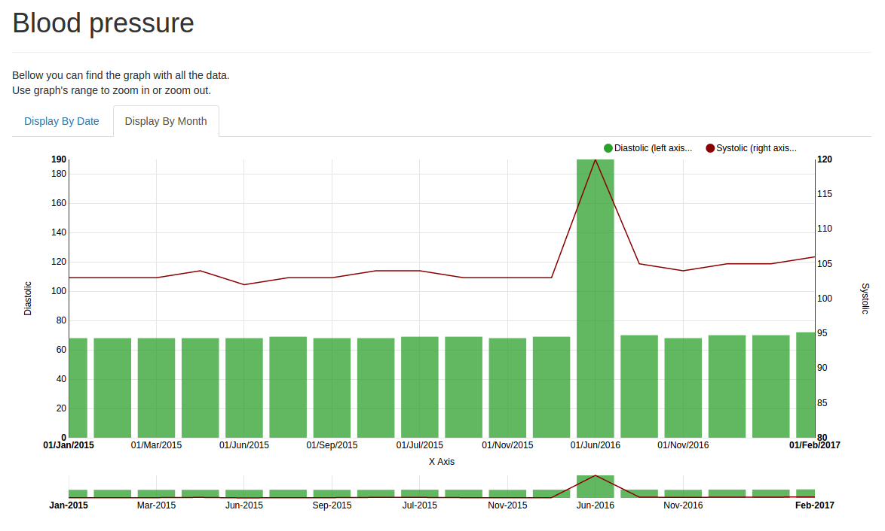

# Result



## Before you start
Before you start let's prepare our project.

* Set configuration file:
```
cp config.default.js config.js
```

* Install modules by using bower:
```
npm run bower
```

* Build `dist` folder:
```
npm run build
```

* Run the server to see the results:
```
npm run server
```

* Enter to http://localhost:3000/